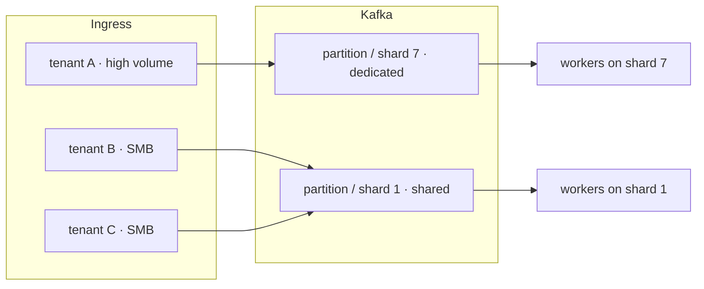

# Capacity

Fleet sizing for the Invoice Extraction product: demand, latency, ingestion, sharding, and adapter serving cost.

Hub: [`SYSTEM.md`](SYSTEM.md). Durability / ops: [`RELIABILITY.md`](RELIABILITY.md). Product / extract: [`PRODUCT.md`](PRODUCT.md) · [`EXTRACTION.md`](EXTRACTION.md).

**Operating point:** 4M docs/day (~46/s avg, ~139/s at 3× peak).  
**Architecture ceiling:** ~100M req/day (~1.16K/s avg, ~3.5K/s peak) — see Demand derivation.

---

## Capacity

```
concurrency = arrival_rate × service_time      (Little's Law)
```

### Demand derivation

10M DAU × 10 req/user/day = 100M req/day; / 86,400s/day = ~1.16K req/s avg, ×3 peak = ~3.5K req/s — architecture ceiling. Operating design point derived bottom-up from US-only, invoices-only tenant counts and AP-industry volume benchmarks:

| Segment | Tenants | Docs/tenant/day | Docs/day |
|---|---|---|---|
| Enterprise | 2,000 | 500 | 1M |
| Mid-market | 20,000 | 100 | 2M |
| SMB | 100,000 | 10 | 1M |

Design point: **4M docs/day**.

### Per-event size

| Artifact | Derivation | Size |
|---|---|---|
| Invoice PDF | ~2–3 pages × ~30–50KB/page (embedded fonts/images) | ~100 KB |
| Parsed markdown | ~50–80 spans/page × ~50 bytes/span (text + layout markers) | ~4 KB |
| Grounded JSON | ~15 fields × (value + bbox[4 floats] + quote + confidence), ~1.6 KB/field | ~25 KB |

### Service-time capacity

| Backend | Service time | In-flight @ 46/s | @ 3× peak (139/s) |
|---|---|---|---|
| Claude API | ~10 s | ~460 | ~1.4K |
| Self-hosted LLM | ~1 s | ~46 | ~140 |
| LayoutLM fast path | ~50–200 ms | ~2–9 | ~7–28 |

Latency determines fleet size directly: a 10× cut in extract time cuts concurrency 10×.

**Storage:** 4M × 100 KB = 400 GB/day PDF → S3 with lifecycle policy. Job records: partition by time, keep &lt; 48h hot in Postgres; older records move to the [warehouse tier](RELIABILITY.md#warehouse-tier-long-term--audit).

**GPU sketch @ 1s/doc, batch 8:** ~6 GPUs, 1 node. Sizing sketch, not a procurement figure.

---

## Ingestion & autoscaling

Ingestion instances are stateless and horizontally autoscaled behind a load balancer. Autoscaling ties to request rate, not CPU — ingestion is I/O-bound (accept, dedup, enqueue), not compute-bound.

**Server-count estimate.**
- ~2K req/s assumed sustained capacity per ingestion instance (accept + dedup + enqueue, no parse/extract work on this tier)
- Ceiling case: ~1.16K req/s avg fits within a single instance; 3× peak (~3.5K req/s) requires ~2
- Operating point (4M/day, ~46 req/s avg, ~139 req/s peak): one instance covers both
- Extract capacity is the bottleneck (see [Service-time capacity](#service-time-capacity)), not ingestion

**Multi-region / multi-AZ.**
- Deployed per-region (see [`SYSTEM.md` topology](SYSTEM.md#target-topology))
- Region = residency boundary (see [`SYSTEM.md` tenancy](SYSTEM.md#tenancy)) + failure-isolation boundary — a regional outage degrades only that region's tenants
- Within a region: instances, Kafka brokers, and Postgres replicas spread across at least 2 AZs
- A single-AZ failure does not stall ingestion or lose acked jobs

---

## Latency budget

P99 target: 15 s, broken into hops:

| Stage | Type | Time | Notes |
|---|---|---|---|
| Ingress → Kafka | enqueue | &lt; 50 ms | token bucket + dedup (Redis ETag) |
| Kafka → Parse pod | queue lag | &lt; 100 ms steady | per-tenant partition fairness |
| Parse (PyMuPDF) | compute | ~200–500 ms | CPU-bound, page-parallel |
| Parse → Extract queue | hop | &lt; 100 ms | independent HPA per stage |
| Extract (LLM) | compute | ~1–10 s | dominant cost; self-hosting reduces this |
| Ground (fuzzy match) | compute | &lt; 50 ms | in-process, no external call |
| Extract → Chat (optional) | on-demand | n/a | not on the ingest critical path |

**Backpressure (parse → extract queue).**
- If queue depth × extract service time exceeds ~2× current in-flight capacity for &gt; 30s, scale extract pods before shedding
- A sustained breach past the HPA ceiling returns 429 upstream rather than let the queue grow unbounded
- Parse is cheap and fast; extract is the bottleneck

---

## Partitioning & sharding

`tenant_id` is the partition and shard key — noisy neighbors stay in their lane.



**Kafka partition key: `tenant_id`.**
- Preserves per-tenant ordering and fairness — a noisy tenant fills its own partition(s), not others'
- Document-type keys would create hot partitions for common types
- Time-based keys would serialize all tenants during peak windows

**DB shard key: `tenant_id`, explicit lookup table, not consistent hashing.**
- Tenant load is heavily skewed
- Hashing risks co-locating a high-volume tenant with others, creating an unrebalanceable hot shard
- An explicit table lets ops move one tenant to a dedicated shard without rehashing the rest

```
tenant_id=acme-corp     -> shard=7  (dedicated, high-volume)
tenant_id=freelancer-42 -> shard=1  (shared pool)
```

Every production query (job status, results, invoice lookup) is scoped by `tenant_id` — a single-shard lookup, never scatter-gather.

---

## Model serving & adapter scaling

Model strategy (classify → LoRA per vertical, DocILE cluster seeding, escalation cascade) is covered in [`EXTRACTION.md`](EXTRACTION.md#model-strategy). This section covers the infra cost of that strategy.

- **Adapter footprint:** the shared base model dominates GPU memory; a LoRA adapter is megabytes, not the multi-GB size of a full model copy. N adapters loaded alongside one base model cost close to base-model GPU sizing, not N × base-model sizing.
- **Routing:** the classify step (see [`EXTRACTION.md`](EXTRACTION.md#model-strategy)) resolves a request to a `cluster_id`; the extract pod loads or already holds the matching adapter and serves the request against base model + adapter.
- **Batching:** requests routed to the same adapter batch together for GPU throughput. Requests spanning different adapters either pay an adapter-switch cost or queue separately per adapter.
- **Cold start:** a new vertical or layout cluster with no trained adapter falls back to the Claude escalation path (see [`EXTRACTION.md` escalation](EXTRACTION.md#escalation-cost-control)) until enough confirmed extractions accumulate to train a patch.
- **Capacity math:** the [GPU sketch](#capacity) above sizes the shared base model at the operating point; adapters run at the LoRA fast-path service time (~50–200 ms), not the Claude/self-hosted-LLM service time.
