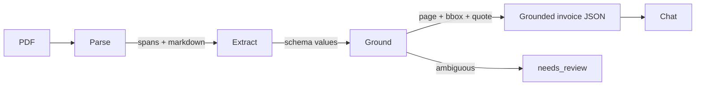
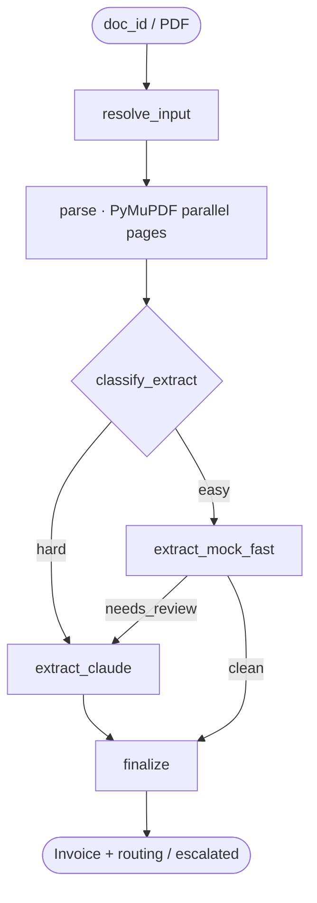
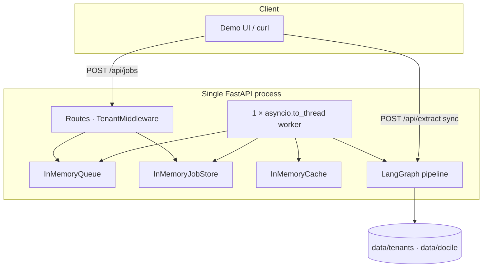
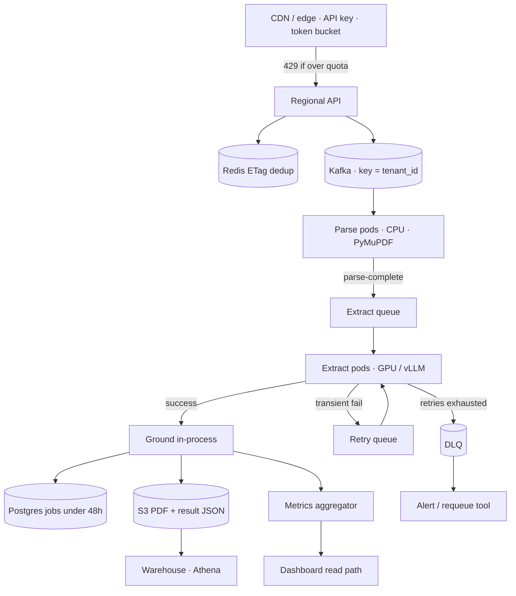
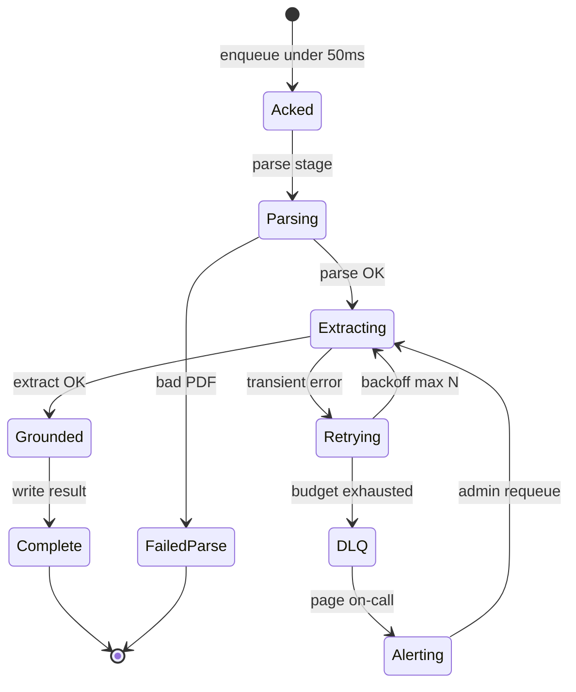
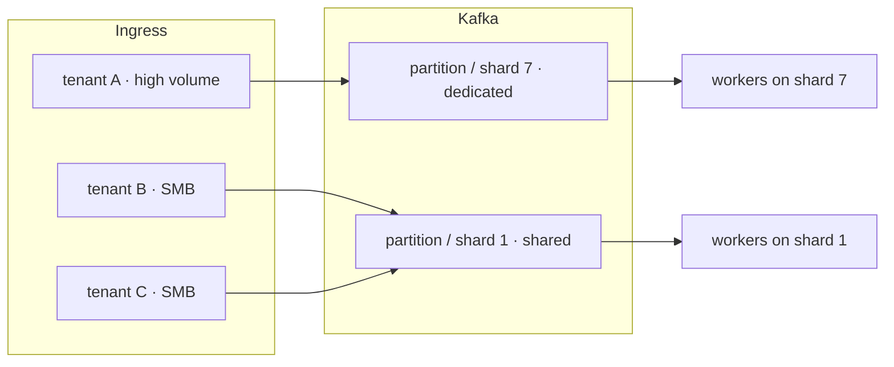
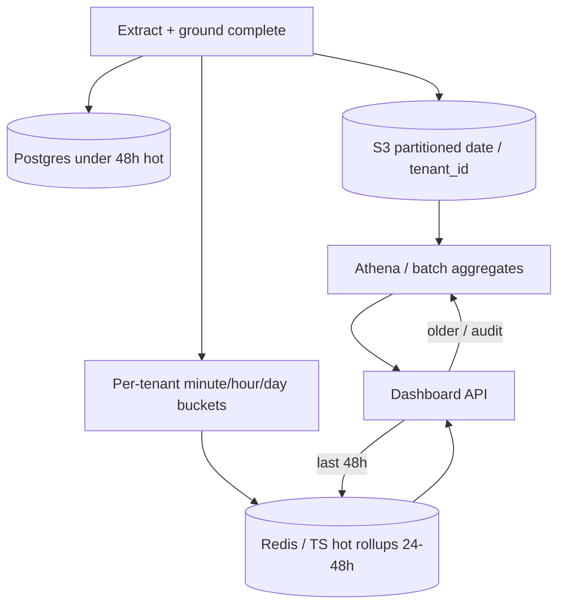

# Diagrams

Architecture sketches for the Invoice Extraction product (Mermaid). Narrative lives in the linked docs — these are the visual map.

| Diagram | Read with |
|---|---|
| [Product surface](#product-surface) | [`PRODUCT.md`](PRODUCT.md) |
| [Extract pipeline (LangGraph)](#extract-pipeline-langgraph) | [`EXTRACTION.md`](EXTRACTION.md#pipeline-today) |
| [Phase 0 (now)](#phase-0-now) | [`SYSTEM.md`](SYSTEM.md) |
| [Target fleet topology](#target-fleet-topology) | [`SYSTEM.md`](SYSTEM.md#target-topology) · [`CAPACITY.md`](CAPACITY.md) |
| [Failure / retry / DLQ](#failure-retry-dlq) | [`RELIABILITY.md`](RELIABILITY.md#extraction-pipeline-failure-durability-and-storage) |
| [Tenant shard and fairness](#tenant-shard-and-fairness) | [`CAPACITY.md`](CAPACITY.md#partitioning--sharding) · [`SYSTEM.md`](SYSTEM.md#tenancy) |
| [Hot path vs warehouse](#hot-path-vs-warehouse) | [`RELIABILITY.md`](RELIABILITY.md#metrics-rollups-dashboard-read-path) |

---

## Product surface

Parse → Extract → Ground → Chat. Boxes never come from the LLM.

Details: [`PRODUCT.md` surface](PRODUCT.md#surface) · [`EXTRACTION.md` grounding](EXTRACTION.md#grounding).

---

## Extract pipeline (LangGraph)

Today’s graph inside one process. Grounding runs inside each extract path.

Escalation and model roadmap: [`EXTRACTION.md`](EXTRACTION.md#escalation-cost-control).

---

## Phase 0 (now)

Contracts only — in-memory queue / cache / jobs, one worker.

Swap map: [`SYSTEM.md` component choices](SYSTEM.md#component-choices).

---

## Target fleet topology

Design point (~4M docs/day). Parse and extract scale independently.

Sizing: [`CAPACITY.md`](CAPACITY.md). Durability: [`RELIABILITY.md`](RELIABILITY.md).

---

## Failure retry DLQ

No silent drops when the LLM backend is down.

Narrative: [`RELIABILITY.md` pipeline](RELIABILITY.md#extraction-pipeline-failure-durability-and-storage).

---

## Tenant shard and fairness

`tenant_id` is the partition and shard key — noisy neighbors stay in their lane.

Lookup table (not consistent hashing): [`CAPACITY.md` partitioning](CAPACITY.md#partitioning--sharding).

---

## Hot path vs warehouse

Dashboards never scan raw job rows. Audit queries use the warehouse tier.

Detail: [`RELIABILITY.md` rollups](RELIABILITY.md#metrics-rollups-dashboard-read-path) · [warehouse](RELIABILITY.md#warehouse-tier-long-term--audit).
